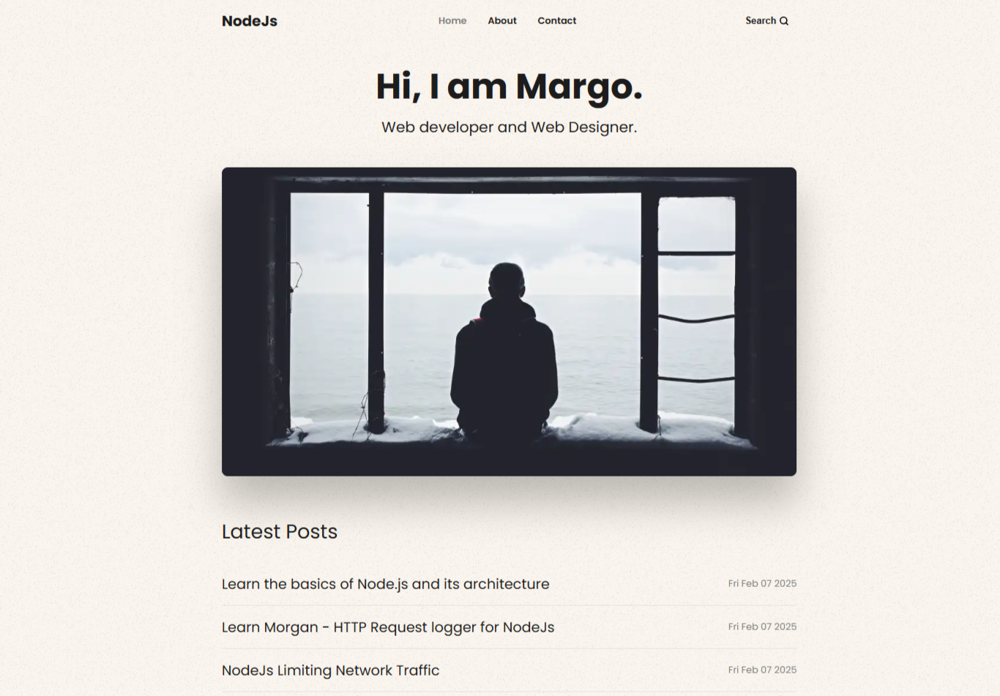

# **Node.js, Express, EJS & MongoDB Blog - CRUD Application**

A **blog application** built using **Node.js, Express, EJS, and MongoDB** with full **CRUD (Create, Read, Update, Delete)** functionality. Users can **view all blog posts**, while an **admin dashboard** provides the ability to **create, edit, and delete posts**.  



## **Features**

- ✅ View all blog posts in a responsive UI  
- ✅ Secure **admin dashboard** for managing content  
- ✅ MongoDB integration for storing blog posts  
- ✅ Dynamic templating with EJS  


---

## **Prerequisites**

Ensure you have the following installed before setting up the project:

- **[Node.js](https://nodejs.org/)** (Latest LTS recommended)
- **MongoDB** (Use a **free cloud database** from [MongoDB Atlas](https://www.mongodb.com/cloud/atlas) or a local MongoDB instance)

---

## **Database Setup**

### **1. Create a Free MongoDB Cluster**

- Sign up at **[MongoDB Atlas](https://www.mongodb.com/)** and create a free cluster.

### **2. Configure the `.env` File**

- Create a `.env` file in the project root and add your credentials:

```env
MONGODB_URI=mongodb+srv://<username>:<password>@clusterName.xxxxxxx.mongodb.net/blog
JWT_SECRET=MySecretBlog
```
